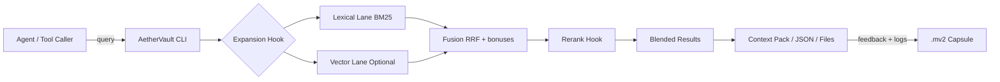
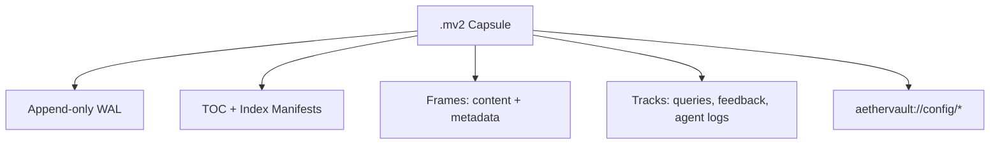

# AetherVault

**AetherVault** is a **single‑file, append‑only memory capsule** plus a **hybrid retrieval engine** for agents.
All content, indexes, embeddings, queries, and feedback live inside one `.mv2` archive.

## Why it's novel

- **Memory is portable, auditable, and mergeable**: everything (content + indexes + query/feedback traces) lives in one capsule you can diff/merge like a repo.
- **Queries are first‑class memory**: searches, expansions, reranks, and feedback are stored as frames, so the system improves while staying explainable.
- **Hybrid retrieval by design**: expansion → lex + vec lanes → fusion → rerank → blend, with hook points for local or remote models.
- **Time‑travel retrieval**: "what did the agent know at time T?" is a built‑in query mode.
- **Agent‑ready surface**: MCP server compatibility, context packs, and a minimal hook‑based agent loop.

## System at a glance





## Design docs

- `docs/ARCHITECTURE.md`

## Quick start

```bash
cargo build --locked

./target/debug/aethervault init knowledge.mv2
./target/debug/aethervault bootstrap knowledge.mv2 --workspace ./assistant
./target/debug/aethervault ingest knowledge.mv2 -c notes -r ~/notes
./target/debug/aethervault search knowledge.mv2 "project timeline" -c notes -n 10
./target/debug/aethervault query knowledge.mv2 "quarterly planning process" -c notes -n 10 --plan
./target/debug/aethervault context knowledge.mv2 "quarterly planning process" -c notes --max-bytes 8000
./target/debug/aethervault put knowledge.mv2 --uri aether://notes/hello.md --text "hello world"
./target/debug/aethervault log knowledge.mv2 --session sprint-42 --role user --text "Summarize release risks"
./target/debug/aethervault feedback knowledge.mv2 --uri aether://notes/plan.md --score 0.7 --note "Good source"
./target/debug/aethervault embed knowledge.mv2 -c notes --batch 64
./target/debug/aethervault get knowledge.mv2 aether://notes/some-note.md
./target/debug/aethervault config set --key index --json '{"context":"You are my assistant"}'
./target/debug/aethervault diff knowledge.mv2 other.mv2
./target/debug/aethervault merge knowledge.mv2 other.mv2 merged.mv2 --force
```

## Tool surface (agent‑friendly)

- `--json` returns a structured plan + results payload.
- `--files` emits tab‑separated `score,frame_id,uri,title`.
- `--log` appends the query + ranked results back into the capsule as an auditable frame.
- `embed` precomputes local embeddings for fast vector retrieval.
- `context` builds a prompt‑ready JSON pack (context + citations + plan).
- `log` records agent turns in the capsule for later audits.
- `feedback` records explicit relevance feedback to bias future rankings.
- `config` stores portable capsule config at `aethervault://config/...`.
- `diff` / `merge` provide git‑like ops for capsules.
- `mcp` starts a stdio tool server.
- `agent` runs a minimal hook‑based assistant loop.
- `bridge` runs Rust‑native Telegram/WhatsApp connectors.
- `bootstrap` scaffolds soul + memory workspace and writes default agent config.
- `schedule` runs daily/weekly autonomous briefings (Telegram optional).
- `watch` runs event-driven triggers (email/calendar).
- `exec` tool executes host commands (host mode default; wrap with `AETHERVAULT_COMMAND_WRAPPER` for sandboxing).
- `connect` runs a built-in OAuth broker for Google/Microsoft tokens.
- Gmail/Calendar and Microsoft mail/calendar tools are available after OAuth (`gmail_*`, `gcal_*`, `ms_*`).
- `http_request` provides a generic API surface (non-GET requires approval).
- `browser` provides CLI-based browser automation via agent-browser (ref-based element selection, named sessions).
- `fs_list`, `fs_read`, `fs_write` give controlled filesystem access within allowed roots.
- Sensitive tools require approval; reply `approve <id>` or `reject <id>` when prompted.
- `tool_search` enables dynamic tool lookup (no bloated prompt).
- `session_context` fetches recent session logs efficiently.
- `reflect` stores self-critique in the capsule for iterative improvement.
- `skill_store` / `skill_search` capture reusable procedures.
- `subagent_list` / `subagent_invoke` provide multi-session orchestration.
- `compact` runs vacuum compaction + index rebuilds (SOTA maintenance).
- `doctor` exposes full repair/verify controls.

## Deployment and connectors

- `docs/DEPLOYMENT.md` for local, Docker, and cloud deployment.
- `docs/CONNECTORS.md` for Telegram + WhatsApp bridges and subagent fan‑out.
- Rust‑native connectors are built in (`bridge`).
- Optional: Himalaya integration enables `email_*` tools for Gmail IMAP workflows.
- `notify`, `signal_send`, `imessage_send` provide outbound messaging helpers.
- Approval gates are always enforced for sensitive tools.
- Set `AETHERVAULT_FS_ROOTS` to restrict filesystem tools.
- Browser automation requires `agent-browser` CLI installed (`npm install -g agent-browser`).

## Maintenance (SOTA compaction)

```bash
./target/release/aethervault compact knowledge.mv2
```

For full control:

```bash
./target/release/aethervault doctor knowledge.mv2 --vacuum --rebuild-time --rebuild-lex --rebuild-vec
./target/release/aethervault doctor knowledge.mv2 --dry-run --json
```

## URI schemes

- `aether://<collection>/<path>` for content
- `aethervault://config/<key>` for portable capsule config

## Optional vector lane

Build with vector support and provide local embedding models:

```bash
cargo build --locked --features vec
```

The embed backend prints a download command if the ONNX model/tokenizer is missing.
Tune performance with `embed --batch N` and query flags like `--embed-cache`.

## Agent hook (minimal harness)

`agent` expects a hook command that reads JSON on stdin and returns JSON:

```bash
./target/debug/aethervault agent knowledge.mv2 --model-hook builtin:claude
```

`builtin:claude` runs the Rust hook in‑process (no subprocess).

## Workspace (Soul + Memory)

The agent can optionally read `SOUL.md`, `USER.md`, `MEMORY.md`, and a daily log in `memory/YYYY-MM-DD.md`
from a workspace directory (default `./assistant` or `AETHERVAULT_WORKSPACE`). Memory writes via tools
are mirrored into the capsule under `aethervault://memory/*` so the single‑file `.mv2` remains the source of truth.

Bootstrap creates templates and writes config:

```bash
./target/release/aethervault bootstrap knowledge.mv2 --workspace ./assistant
```

## Autonomous scheduling

Run daily/weekly briefings (Telegram delivery optional):

```bash
export TELEGRAM_BOT_TOKEN=123456:ABC
export AETHERVAULT_TELEGRAM_CHAT_ID=123456789

./target/release/aethervault schedule knowledge.mv2 --workspace ./assistant --model-hook builtin:claude
```

For longer tool‑using sessions, raise the step budget:

```bash
./target/release/aethervault agent knowledge.mv2 --model-hook builtin:claude --max-steps 128 --log-commit-interval 8
```

See `docs/ARCHITECTURE.md` for the hook payload shapes.

## Claude hook (Anthropic)

Set env vars and run the agent with the hook:

```bash
export ANTHROPIC_API_KEY=sk-ant-...
export ANTHROPIC_MODEL=claude-<model>
export ANTHROPIC_MAX_TOKENS=1024

./target/release/aethervault agent knowledge.mv2 --model-hook builtin:claude
```

Optional hook env vars: `ANTHROPIC_BASE_URL`, `ANTHROPIC_TEMPERATURE`, `ANTHROPIC_TOP_P`,
`ANTHROPIC_TIMEOUT`, `ANTHROPIC_MAX_RETRIES`.
Performance toggles: `ANTHROPIC_PROMPT_CACHE=1`, `ANTHROPIC_PROMPT_CACHE_TTL=5m`,
`ANTHROPIC_TOKEN_EFFICIENT=1` (token‑efficient tools beta).

Optional: persist the hook in the capsule config so you can omit `--model-hook`:

```bash
./target/release/aethervault config set --key index --json '{
  "agent": {
    "model_hook": { "command": "builtin:claude", "timeout_ms": 60000 },
    "log": true,
    "max_steps": 128,
    "log_commit_interval": 1
  }
}'
```

Note: `log_commit_interval=1` fsyncs each log entry (best durability). Increasing it improves throughput but can lose the last N log entries on a crash.

## Docker deploy (minimal)

Build and run the CLI in a container (mount a capsule at `/data`):

```bash
docker build -t aethervault .
docker run --rm -it -v "$(pwd)/data:/data" aethervault init /data/knowledge.mv2
docker run --rm -it -v "$(pwd)/data:/data" aethervault mcp /data/knowledge.mv2
```

Or with Compose:

```bash
export ANTHROPIC_API_KEY=sk-ant-...
export ANTHROPIC_MODEL=claude-<model>
docker compose up --build
```

If you want to run the Claude hook inside the container, you can use the built‑in Rust hook:

```bash
docker build -t aethervault .
docker run --rm -it \
  -e ANTHROPIC_API_KEY=sk-ant-... \
  -e ANTHROPIC_MODEL=claude-<model> \
  -v "$(pwd)/data:/data" \
  aethervault agent /data/knowledge.mv2 --model-hook builtin:claude
```

## Implemented roadmap

- Optional vector search lane with on‑device embeddings (default build is lex‑only).
- Pluggable reranker + expansion hooks (drop‑in local or remote).
- MCP‑compatible tool server backed by the capsule.
- Portable capsule config stored at `aethervault://config/...`.
- Capsule diff + merge tooling (git‑like for memory).

---

## Intelligence Layer (Python)

The intelligence layer adds autonomous lifecycle automation, a knowledge graph, model proxy routing, and session management on top of the Rust capsule binary.

### Architecture

```
Telegram / WhatsApp
        |
   AetherVault Gateway (port 18789)
        |
   Capsule Memory (MV2 append-only store)
        |
   Intelligence Layer (Python)
   |- Knowledge Graph (NetworkX, JSON-backed)
   |- Morning Briefing Generator
   |- Nightly Consolidation (summarize + extract facts)
   |- Evening Check-In
   |- Session Manager (spawn/list/check/kill background agents)
   |- Capabilities Registry (auto-discover hooks, crons, services)
        |
   Model Proxy Layer
   |- Vertex AI Proxy  (port 11436) -- Claude on GCP with token tracking
   |- Moonshot Proxy   (port 11437) -- Kimi K2.5 via OpenAI-compat API
   |- llama.cpp Proxy  (port 11434) -- local models via SSH tunnel
```

### Key Components

**Knowledge Graph** -- `knowledge-graph.py`
NetworkX-based directed graph stored as JSON. Supports entity/relation CRUD, NLP-based
text ingestion, context summaries, and atomic file-locked transactions.

**Model Proxy Layer** -- `vertex_proxy.py`, `moonshot_proxy.py`, `llama_proxy.py`
Lightweight HTTP proxies that translate between the Anthropic Messages API and various
backends. The Vertex proxy handles SSE token tracking fixes; the Moonshot proxy rewrites
model names; the llama proxy tunnels requests over SSH to a local GPU machine.

**Daily Lifecycle**
- `scripts/morning-briefing.py` -- Gathers weather, email, calendar, knowledge graph projects, and yesterday's summary. Sends via Telegram.
- `scripts/nightly-consolidation.py` -- Reads agent logs from the capsule, uses Claude to extract facts/entities/relations, updates MEMORY.md and the knowledge graph.
- `scripts/proactive-checkin.py` -- Evening nudge surfacing unaddressed items.

**Session Manager** -- `scripts/session-manager.py`
Spawns named background agent sessions with per-session capsules to avoid lock contention.

**Capabilities Registry** -- `scripts/capabilities.py`
Auto-discovers hooks, cron jobs, and systemd services. The agent queries it before attempting to use any capability.

### Intelligence Layer Quick Start

```bash
# Install Python dependencies
pip install -r requirements-core.txt

# Start proxy services
bash start_services.sh

# Set up cron jobs for daily lifecycle
# 0 8 * * 1-5 ~/.aethervault/hooks/morning-briefing.sh
# 0 23 * * *  ~/.aethervault/hooks/nightly-consolidation.sh
```

### Configuration

Copy `config/env.example` to `~/.aethervault/.env` and edit it. The runtime config lives in `config/aethervault.json`.

See `config/env.example` for the complete list of environment variables with defaults and comments.

### DigitalOcean Deployment

```bash
export DO_TOKEN="your-digitalocean-api-token"
bash deploy/digitalocean/provision.sh
```

See `deploy/digitalocean/README.md` for the full deployment guide.

### Project Structure (Intelligence Layer)

```
.
├── knowledge-graph.py          # Knowledge graph engine (NetworkX)
├── vertex_proxy.py             # Vertex AI Claude proxy with token tracking
├── moonshot_proxy.py           # Moonshot/Kimi proxy
├── llama_proxy.py              # llama.cpp proxy via SSH tunnel
├── start_services.sh           # Start all proxy services
├── scripts/                    # Lifecycle scripts (briefing, consolidation, etc.)
├── config/
│   ├── env.example             # Environment variable template
│   ├── aethervault.json        # Runtime configuration
│   └── auth-profiles.json      # Provider auth profiles
├── deploy/
│   ├── digitalocean/           # DO provisioning scripts
│   └── systemd/                # Systemd service files
├── superclustered/             # Django community app
├── requirements.txt            # Django app dependencies
└── requirements-core.txt       # Intelligence layer dependencies
```

## License

MIT License. See [LICENSE](LICENSE).
